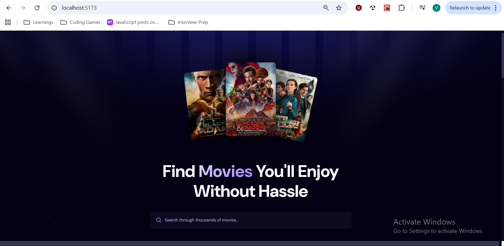
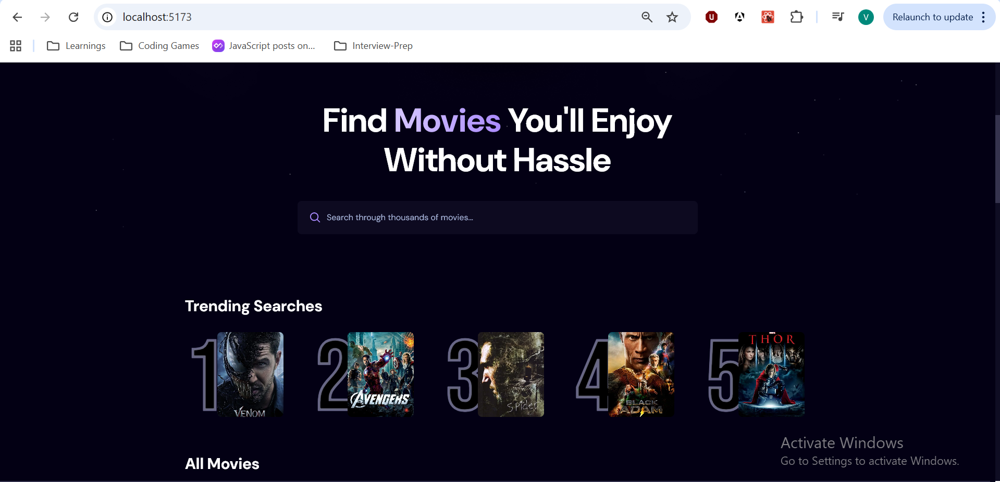
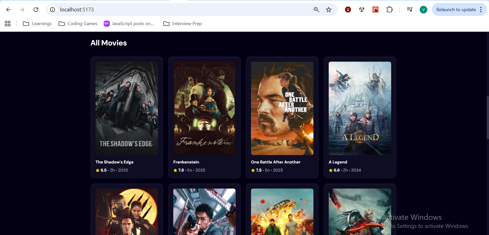
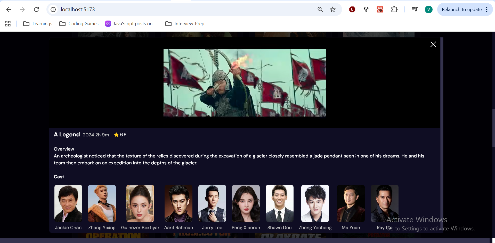

## Getting Started

Requirements:

1. node version: 20.11.1
2. VS code editor
3. Clone the repository
4. Ensure db is setup in appwrite to calculate trending movies.

Install the dependencies, run:

```bash
npm install
```

To start a local development server, run:

```bash
npm run dev
```

Once the server is running, open your browser and navigate to [http://localhost:5173/](http://localhost:5173/). The application will automatically reload whenever you modify any of the source files.

## Movie App

This website provides an easy way to view popular movies and quickly find titles you care about.

- Search: use the search box to look up any movie by title; results update as you type.
- Trending: the most popular/trending movies are shown in a separate "Trending Searches" section for quick discovery.

## Screenshots








